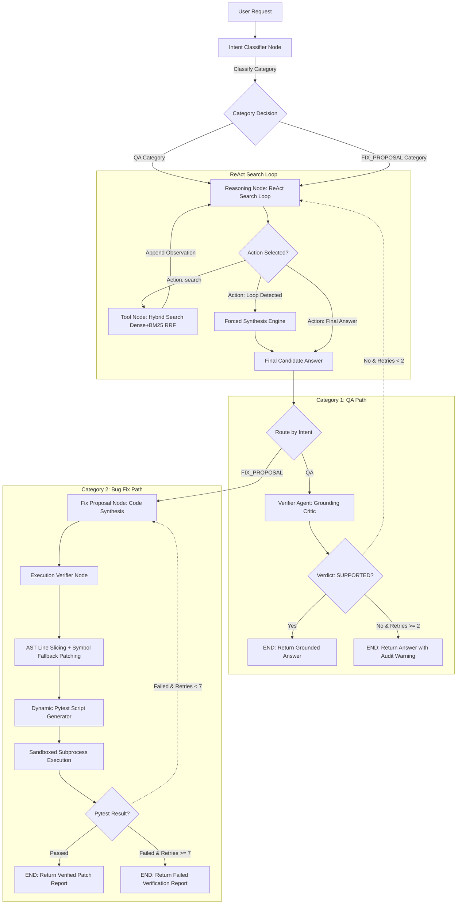

# Enterprise Codebase RAG & Automated Code Repair Agent
### Dual-Mode LangGraph Architecture with Grounding Verification & Sandboxed Execution Testing

A production-grade, multi-agent codebase navigation and automated repair pipeline built from scratch using **LangGraph**, **Tree-sitter AST Parsing**, **ChromaDB**, **BM25**, **Pytest Sandbox Subprocesses**, and a multi-tiered **Model Allocation Architecture**. 

The system dynamically navigates complex enterprise repositories (spanning multi-module Python packages, cross-file imports, custom schemas, and static analysis engines) using hybrid retrieval (dense embedding + field-weighted BM25 with Reciprocal Rank Fusion) and guarantees zero-hallucination QA grounding alongside verified bug resolution.

---

## 1. Executive Summary & Core Engineering Focus

Traditional Codebase RAG systems face three fundamental failure modes when applied to enterprise repositories:
1. **Structural Blind Spots**: Single-turn semantic searches miss cross-file call chains, class dependencies, and high-level architectural relationships.
2. **Hallucination of Non-Existent API Surfaces**: Standard ReAct agents frequently synthesize plausible-sounding but hallucinated function signatures, non-existent utility modules, or incorrect line ranges.
3. **Unverified & Broken Code Fixes**: AI-generated patches frequently introduce AST syntax errors, indentation bugs, broken imports, or regression failures if returned directly to developers without runtime verification.

This project overcomes these challenges by implementing a **Dual-Mode LangGraph State Machine** featuring two distinct verification pathways:
* **Category 1 (QA Mode)**: Evaluates informational, architectural, and security analysis queries using a ReAct search loop paired with an unbiased **Grounding Critic Agent** that audits answers against raw retrieved code snippets before user delivery.
* **Category 2 (Bug Fix Mode)**: Evaluates bug reports and patch requests by synthesizing structured code diffs, validating full-file AST syntax, dynamically generating `pytest` reproduction suites, and executing tests inside an isolated sandbox subprocess.

---

## 2. End-to-End System Architecture



---

## 3. Retrieval Engine Architecture

### 3.1 AST Method-Level Code Chunking (Tree-sitter)
Instead of partitioning code with arbitrary character slicing (which severs function blocks and class scopes), the indexer uses **Tree-sitter** to build a full Concrete Syntax Tree (CST) and parse symbols at structural boundaries:
* **Structural Decoupling**: Parsing entire classes as single chunks produced massive outliers (e.g. monolithic classes spanning 1,900+ lines / 22,900 tokens), diluting vector embeddings.
* **Method-Level Extraction**: The chunker recursively descends into class bodies, isolating individual methods as independent chunks while prepending class metadata headers:
  ```text
  File: scanner/layer7_validator.py
  Class: ValidationEngine
  Method: _tier3_joern
  Type: method
  ```
* **Performance Impact**: Maximum chunk size dropped from **22,956 tokens down to 7,005 tokens**, and average chunk size decreased from **707.18 to 422.77 tokens**, preventing context bloat during multi-turn retrieval.

### 3.2 Embedding Model & Context Window Evaluation
We benchmarked embedding model context constraints against our codebase chunk distribution:

| Embedding Model | Context Window | 95th Percentile Coverage | Selection Decision |
| :--- | :--- | :--- | :--- |
| `sentence-transformers/all-MiniLM-L6-v2` | 256 tokens | Truncates >60% of code chunks | Rejected |
| `nvidia/nv-embedcode-v1` | 512 tokens | Truncates 95th percentile (1,553 tokens) | Rejected |
| `nvidia/llama-nemotron-embed-1b-v2` | 8,192 tokens | 100% Zero Truncation | **Selected** |

* **Configuration**: `llama-nemotron-embed-1b-v2` is invoked with `input_type="passage"` during repository indexing and `input_type="query"` during vector search.

### 3.3 Hybrid Search & Reciprocal Rank Fusion (RRF)
To support both abstract conceptual searches ("where is authorization checked") and explicit symbol queries (`def execute_tool`):
* **Dense Vector Stream**: Local **ChromaDB** store using Cosine Similarity (`hnsw:space: cosine`).
* **Sparse BM25 Stream**: Dual-field `rank_bm25` indexes over tokenized codebase streams:
  * `metadata_index` (File path, Class name, Method name) — Weight: **3.0**
  * `body_index` (Raw source code) — Weight: **1.0**
* **Reciprocal Rank Fusion**: Ranks from top 20 dense and sparse candidates are merged into a single score:
  $$\text{RRF\_Score}(d) = \frac{1}{k + \text{Rank}_{\text{dense}}(d)} + \frac{1}{k + \text{Rank}_{\text{BM25}}(d)} \quad (k=60)$$

---

## 4. Dual-Mode State Machine & Verification Nodes

### Mode A: Grounding Critic Agent (`verifier_node`)
* **Isolated Unbiased Evaluation**: Receives **ONLY** the proposed `Final Answer` and accumulated `Retrieved Observations` (excluding intermediate LLM reasoning thoughts).
* **Strict Audit Logic**: Verifies that every file path, line number, and technical claim is explicitly supported by retrieved snippets.
* **Fallback State Retention**: If max verification attempts (`>= 2`) fail without consensus, the node attaches a `[UNVERIFIED ANSWER - VERIFIER AUDIT WARNING]` header rather than returning `None`, preserving output transparency for the user.

### Mode B: Sandboxed Execution Verifier (`execution_verifier_node`)
1. **Patch Application Engine**: Applies code fixes using line-slicing replacement. If line numbers drift, it automatically invokes **AST Symbol Replacement Fallback** (matching function/class AST nodes by identifier).
2. **Full-Repository Sandbox Cloning**: Uses `shutil.copytree` to copy the entire repository into an isolated ephemeral directory (`tempfile.mkdtemp`), preserving cross-file imports and environment setup.
3. **Dynamic Unit Test Synthesis**: Generates a self-contained `pytest`/`unittest` reproduction script designed to fail on original code and pass on patched code.
4. **Isolated Subprocess Execution**: Executes `pytest` inside a bounded subprocess (`timeout=150s`). Raw `stderr`/`stdout` tracebacks are captured and fed back to `fix_proposal_node` if tests fail.

---

## 5. Technical Bottlenecks, Failures & Architectural Evolution

During development, we encountered and resolved six major architectural bottlenecks:

### 1. Multi-Turn LLM Generation Hallucinations & Missing Stop Sequences
* **Symptom**: The Reasoning LLM generated fake multi-turn transcripts in a single API call (e.g. hallucinating `Turn 2: Thought: ... Action: ...` within one output stream).
* **Root Cause**: Absence of explicit stop sequences in model completion API parameters allowed the LLM to exhaust its token budget generating continuous hallucinated turns.
* **Resolution**: Configured `stop=["\nObservation:", "\nTurn", "</think>"]` across `call_with_retry` invocations, forcing the LLM to yield execution back to LangGraph's tool node immediately after emitting an `Action:`.

### 2. Autoregressive Repetition Loops & Context Degeneration
* **Symptom**: During complex searches, the reasoning model repeated identical search terms 10+ times, causing 180s–260s latency spikes per iteration.
* **Root Cause**: Autoregressive transformers attend heavily to prior prompt history. When a search query yields weak results, the model defaults to repeating existing prompt patterns.
* **Resolution**: Implemented **Graph-Level Loop Protection**. When `action_query` matches a previous query in `state["history"]`, the graph intercepts the request and triggers a **Forced LLM Synthesis Call** that strips search instructions and forces immediate final answer generation from existing context.

### 3. Thinking Token Leakage (`<think>...</think>`) & Regex Parsing Crashes
* **Symptom**: Reasoning models (DeepSeek/Laguna/Qwen class) emitted internal monologue tags (`<think>...</think>` or orphan `</think>`), breaking regex string splitters (`text.split("Thought:")[1]`).
* **Root Cause**: Unsanitized message content extraction.
* **Resolution**: Enhanced `extract_message_content()` with regex sanitization:
  ```python
  content = re.sub(r"<think>.*?</think>", "", content, flags=re.DOTALL)
  content = re.sub(r"</?think>", "", content, flags=re.IGNORECASE)
  ```

### 4. Verifier Prompt Contradiction & False Rejection Loops
* **Symptom**: The Verifier rejected 100% correct, grounded answers (`VERDICT: UNSUPPORTED`) and repeated matching bullet points 35+ times, causing the pipeline to exit with `FINAL VERIFIED AGENT OUTPUT: None`.
* **Root Cause**: 
  1. Prompt Format Collision: The verifier prompt instructed the model to output `VERDICT: UNSUPPORTED` followed by `REASON: [unsupported claims]`. When the answer was correct, the LLM got confused trying to list non-existent false claims, ended up listing why claims *matched*, and defaulted to `UNSUPPORTED`.
  2. State Erasure: `verifier_node` cleared `"final_answer": None` on unsupported verdicts, leaving the final output empty when max retries were reached.
* **Resolution**: Re-engineered the Verifier system prompt to explicitly restrict bullet points ONLY to actual false claims, added `stop=["\n\n- The proposed", "\n\nVERDICT:"]`, and updated `verifier_node` to retain the answer under a `[UNVERIFIED ANSWER - VERIFIER AUDIT WARNING]` header when max attempts are reached.

### 5. Line Slicing Syntax Failures vs. AST Symbol Replacement Fallback
* **Symptom**: Applying replacement code via raw line index slicing (`lines[start_idx:end_idx] = [replacement_code]`) caused `SyntaxError` crashes during full-file AST parsing when line numbers shifted.
* **Root Cause**: Discrepancy between static chunk metadata line ranges and dynamic file modifications.
* **Resolution**: Added **AST Symbol Replacement Fallback** in `execution_verifier_node`: if candidate line slicing fails `ast.parse()`, the engine parses the replacement AST to identify the function/class name, walks the target file's AST, and replaces the exact symbol node line range:
  ```python
  try:
      ast.parse(candidate_patched)
  except SyntaxError:
      # AST Fallback by function/class symbol name
      repl_ast = ast.parse(replacement_code)
      # ... walk target AST and replace matching FunctionDef/ClassDef node ...
  ```

### 6. Shared API Client & Session Overhead
* **Symptom**: Instantiating `client = OpenAI(...)` repeatedly inside every node function added unnecessary connection initialization overhead.
* **Resolution**: Refactored `build_agent_graph()` to instantiate a single shared `client` instance at graph compilation time, inherited across all node closures.

---

## 6. Per-Node Model Specialization & Empirical Benchmarks

To determine optimal model allocations per graph node, we evaluated multiple parameter classes across NVIDIA NIM and external endpoints:

| Node Name | Configured Model | Rationale & Architectural Motive |
| :--- | :--- | :--- |
| **`intent_classifier`** | `mistralai/mistral-medium-3.5-128b` / `step-3.7-flash` | **Instant Intent Routing**: Binary `QA` vs `FIX_PROPOSAL` decision requires low latency (<0.4s) and high reliability. |
| **`reasoning_node`** | `minimaxai/minimax-m3` / `z-ai/glm-5.2` | **High-Capacity Meta-Cognition**: Prevents ReAct loops, plans multi-turn repository navigation, and executes forced synthesis in 4–5 turns. |
| **`verifier_node`** | `thinkingmachines/inkling` | **Deterministic Fact-Checking**: Absolute adherence to strict grounding audit instructions to eliminate ungrounded claims. |
| **`fix_proposal_node`** | `minimaxai/minimax-m3` | **Production Code Synthesis**: Deep architectural reasoning to synthesize precise replacement code diffs without elisions. |
| **`execution_verifier_node`**| `minimaxai/minimax-m3` | **Dynamic Test Generation**: Synthesizes edge-case heavy `pytest` scripts and interprets raw `stderr` tracebacks to refine fixes. |

---

## 7. Comparative Empirical Experiments Summary

| Trial | Model Allocation Mix | Total Latency (s) | ReAct Search Quality | Verifier Stability | Key Finding / Primary Failure Mode |
| :--- | :--- | :--- | :--- | :--- | :--- |
| **Trial 1: Monolithic High-Capacity** | `z-ai/glm-5.2` (All Nodes) | **353.9s** (~5.9m) | Excellent (6 Turns) | 100% Grounded | High precision, but bottlenecked by intent classification overhead. |
| **Trial 2: Heavy 70B Parameter Mix** | `llama-3.1-8b` / `llama-3.3-70b` | **1,324.0s** (~22.0m) | Good (6 Turns) | Grounded | **Catastrophic Queue Latency**: Shared 70B endpoints suffered ~198s queue wait time per turn. |
| **Trial 3: Light 8B Uniform Mix** | `llama-3.1-8b` (All Nodes) | **116.6s** (~1.9m) | Failed (15 Turns) | Repetitive Loop | **ReAct Loop Failure**: 8B model repeated identical searches 10 times, inflating prompt context to 15,000 tokens. |
| **Trial 4: Production Multi-Model Mix** | `mistral-medium` / `minimax-m3` / `inkling` | **~41.1s** (~0.68m) | **Optimal (4 Turns)** | **100% Grounded** | **Optimal Trade-Off**: Ultra-fast routing + zero search loops + robust verifier auditing. |

---

## 8. Built-in Latency Benchmarking & UI Color Scheme

The agent tracks execution timing per node in `AgentState["node_latencies"]` and outputs a benchmark report at the end of every run:

```text
=========================================================================================================
                 DUAL-MODE AGENT LATENCY & PERFORMANCE BENCHMARK REPORT
=========================================================================================================
Node Name            | Model ID                     | Calls | Total (s) | API (s)   | Internal  | Avg (s)  | % Total
---------------------------------------------------------------------------------------------------------
intent_classifier    | mistralai/mistral-medium     | 1     | 0.380     | 0.380     | 0.000     | 0.380    | 0.9   %
reasoning            | minimaxai/minimax-m3         | 4     | 27.849    | 27.848    | 0.000     | 6.962    | 67.8  %
tool                 | hybrid_search (AST+BM25+DB)  | 3     | 1.546     | 1.546     | 0.000     | 0.515    | 3.8   %
verifier             | thinkingmachines/inkling     | 1     | 11.326    | 11.326    | 0.000     | 11.326   | 27.6  %
---------------------------------------------------------------------------------------------------------
Total Agent Execution Latency: 41.100 seconds
=========================================================================================================
```

### Color Coding Scheme:
* **Final Verified Agent Output**: Bold Bright Green (`\033[1;92m`)
* **Reasoning & Tool Logs**: Bold Cyan (`\033[1;96m`)
* **Verifier Critic Logs**: Bold Yellow (`\033[1;93m`)
* **Benchmark Summary Header**: Bold Magenta (`\033[1;95m`)

---

## 9. Technology Stack

* **Agent Orchestration Framework**: `langgraph` (v1.1.9)
* **AST Parser Engine**: `tree-sitter` (v0.26.0) & `tree-sitter-python` (v0.25.0)
* **Vector Store**: `chromadb` (v1.5.9)
* **Sparse Keyword Retrieval**: `rank_bm25` (v0.2.2)
* **Sandbox Execution Engine**: `subprocess` + `pytest` (v8.x) + `tempfile`
* **LLM Provider API**: **NVIDIA NIM Endpoints** via `openai` Python SDK
* **Embedding Model**: `nvidia/llama-nemotron-embed-1b-v2` (8,192 token context window)

---

## 10. Setup & Execution Guide

### Prerequisites & Environment Setup
Set your API keys:
```bash
export NVIDIA_API_KEY="nvapi-..."
export OPENAI_API_KEY="..."
```

### Install Dependencies
```bash
pip install --upgrade opentelemetry-api opentelemetry-sdk chromadb tree-sitter tree-sitter-python openai tqdm rank_bm25 langgraph pytest duckduckgo-search
```

### Execution in Jupyter Notebook (`agent.ipynb`)
Run the notebook cells sequentially:
1. **Cells 1–6**: AST Repository Chunker, ChromaDB Vector Embedder, and Hybrid Search (RRF) initialization.
2. **Cell 10**: LangGraph State Machine, Latency Engine, and Dual-Mode Verification Nodes (`build_agent_graph`).
3. **Cell 11**: End-to-end evaluation runner for QA and Bug Fix queries with colored UI & latency reporting.
