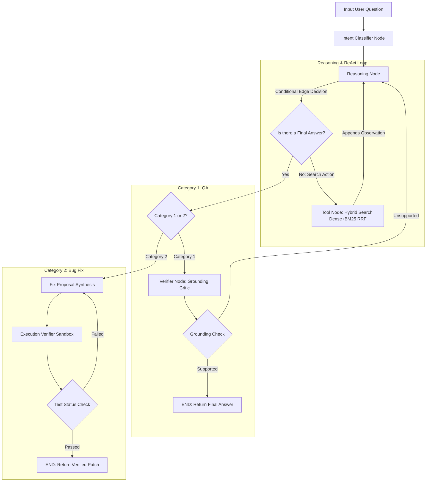

# Codebase RAG & Automated Repair Agent with Dual-Mode Grounding & Execution Verifier

A production-grade, dual-mode ReAct & Code Repair Agent built from scratch using **LangGraph**, **Tree-sitter**, **ChromaDB**, **BM25**, **Pytest Sandbox Subprocesses**, and a multi-tiered **Model Allocation Pipeline**. The agent dynamically navigates repository codebases using hybrid retrieval (dense embedding + field-weighted BM25 with Reciprocal Rank Fusion) and enforces strict zero-hallucination & verified bug resolution guarantees.

The system was evaluated and tested end-to-end against **VibeCheck Scan / VibeSec Pipeline** (a 9-layer AI-driven static application security testing scanner containing cross-file imports, database schemas, and AI-triage engines).

---

## 1. Motivation & Technical Focus

While traditional RAG pipelines rely on single-shot document retrieval and direct LLM generation, codebase QA and automated bug repair present three unique challenges:
1. **Structural Blind Spots**: High-level architectural flows (e.g. entry points, call-graph chains) cannot be captured by single-turn semantic search alone.
2. **LLM Hallucinations**: Standard ReAct agents often synthesize plausibly sounding but unverified claims (e.g., hallucinating API endpoint paths, missing wrapper layers, or misrepresenting class inheritance).
3. **Unverified Code Fixes**: AI-generated code patches frequently introduce AST syntax errors, invalid imports, or breaking regressions if returned without execution testing.

This project resolves these challenges by implementing a **Dual-Mode LangGraph State Machine**:
- **Category 1 (QA Mode)**: Paired with an automated **Grounding Critic LLM** that audits final answers against raw retrieved code observations before returning them to the user.
- **Category 2 (Bug Fix Mode)**: Paired with an **Execution Verifier Engine** that validates AST syntax, dynamically generates pytest reproduction scripts, and executes pre/post fix tests inside an isolated sandbox subprocess.

---

## 2. System Architecture



### 2.1 AST-Based Structural Chunking (Method-Level)
Instead of dividing code into arbitrary character windows (which breaks function syntax and context boundaries), the repository chunker uses **Tree-sitter** to parse Python code into an Abstract Syntax Tree (AST).
* **Motive for AST Granularity**: Initially, entire classes were parsed as single chunks. However, this produced massive outliers: the main `CodeIndexer` class spanned 1,900+ lines (22,956 tokens), diluting vector embeddings and confusing semantic search.
* **Method-Level Extraction**: The chunker recursively descends into class structures, extracting **individual methods** as separate chunks. To preserve class context, each method chunk is prefixed with class-level metadata:
  ```text
  File: scanner/layer7_validator.py
  Class: ValidationEngine
  Method: _tier3_joern
  Type: method
  ```
* **Impact**: Maximum chunk size dropped from **22,956 to 7,005 tokens**, and average chunk size decreased from **707.18 to 422.77 tokens**. This results in surgically precise retrieval, preventing context bloat.

### 2.2 Embedding Model Selection
We evaluated multiple embedding models against the codebase chunk distribution:
1. `sentence-transformers/all-MiniLM-L6-v2`: 256-token context window. Truncates over 60% of code chunks.
2. `nvidia/nv-embedcode-v1`: 512-token context window. Truncates the 95th percentile of chunks (1,553.40 tokens).
3. `nvidia/llama-nemotron-embed-1b-v2`: 8,192-token context window.

**Decision & Motive**: We selected `llama-nemotron-embed-1b-v2` to guarantee zero truncation across 100% of the repository's code chunks. We use `input_type="passage"` during indexing and `input_type="query"` during query retrieval.

### 2.3 Hybrid Search & RRF Fusion
To combine deep semantic vector matching with exact symbol/variable lookups:
* **Motive for Hybrid Search**: Codebases require finding explicit exact symbolic matches (like `ValidationEngine._tier3`) and abstract conceptual matches (like "where do we validate users"). Vector databases (dense search) are great for conceptual searches, while BM25 (sparse search) excels at exact symbolic lookups.
* **Dense Stream**: Local **ChromaDB** vector store using Cosine Similarity.
* **Sparse (BM25) Stream**: Dual-field `rank_bm25` indexes:
  * `metadata_index` (File path, Class name, Method name) — Weight: **3.0**
  * `body_index` (Raw source code) — Weight: **1.0**
* **Fusion**: Top 20 candidates from both streams are fused using **Reciprocal Rank Fusion (RRF)**:
  $$\text{RRF\_Score}(d) = \frac{1}{k + \text{Rank}_{\text{dense}}(d)} + \frac{1}{k + \text{Rank}_{\text{BM25}}(d)}$$

---

## 3. Dual-Mode Verification Architecture & Sandbox Retries

### Mode A: Grounding Critic & Verifier (`verifier_node`)
For Category 1 (QA) queries, the agent routes candidate answers to a strict Grounding Critic:
* **Motive for Grounding Critic**: Standard LLMs easily hallucinate endpoints and functions based on naming conventions. The Critic provides a safety check.
* **Unbiased Context Isolation**: The verifier receives **ONLY** the proposed `Final Answer` and consolidated `Retrieved Observations` across search turns (intermediate thoughts and queries are excluded to keep evaluation unbiased).
* **Self-Correction Loop**: If unsupported, it injects feedback back to `reasoning_node` (max attempts reached triggers self-correction).

### Mode B: Fix Proposal & Sandboxed Execution Verifier (`execution_verifier_node`)
For Category 2 (Bug Fix Proposal) queries:
1. **Fix Synthesis (`fix_proposal_node`)**: Synthesizes structured diagnosis, relative target file path, original code snippet, and fixed replacement code snippet.
2. **AST Syntax Validation (`ast.parse`)**: Validates replacement code syntax prior to execution.
   * **Motive for AST Check**: Indentation errors can crash the whole process. By running `ast.parse` internally, the agent automatically retries generating a patch if syntax is invalid.
3. **Dynamic Unit Test Generation**: LLM dynamically writes a standalone `pytest`/`unittest` reproduction script.
4. **Sandboxed Subprocess Execution**:
   * **Motive for Subprocess Isolation**: Executing arbitrary LLM-generated code poses severe security and state-corruption risks. We run fixes inside an isolated temp directory (`tempfile.mkdtemp`), using bounded subprocesses with short timeouts. If tests fail, the stderr trace is sent back to the `fix_proposal_node` to retry.

---

## 4. Per-Node Model Specialization & Architectural Decisions

We transitioned from monolithic model allocations to a highly specialized multi-LLM architecture to eliminate queueing bottlenecks, prevent infinite loops, and maximize speed and accuracy.

| Node Name | Configured Model | Rationale & Architectural Motive |
| :--- | :--- | :--- |
| **`intent_classifier`** | `stepfun-ai/step-3.7-flash` | **Motive: Instant Routing.** Binary `QA` vs `FIX_PROPOSAL` decision requires low latency and high reliability. Step-3.7-flash completes this in **~0.3s**, eliminating initial 10s heavy model queueing bottlenecks. |
| **`reasoning_node`** | `minimaxai/minimax-m3` | **Motive: High-Intelligence Meta-Cognition.** Small 8B parameter models lack high-level planning, resulting in infinite repetitive search loops (e.g., repeatedly calling `search("foo")` 15 times). Minimax M3 possesses the high-capacity meta-cognition required to navigate complex repositories iteratively in 4–6 turns without token bloat. |
| **`verifier_node`** | `thinkingmachines/inkling` | **Motive: Strict Anti-Hallucination Guardrails.** Requires absolute determinism and rigorous adherence to strict fact-checking instructions, ensuring zero ungrounded claims slip into the final answer. |
| **`fix_proposal_node`** | `minimaxai/minimax-m3` | **Motive: High-Quality Code Synthesis.** Deep architectural understanding to synthesize accurate diffs and understand cross-file dependencies. |
| **`execution_verifier_node`**| `minimaxai/minimax-m3` | **Motive: Robust Test Generation & Iteration.** Synthesizes edge-case heavy `pytest` scripts and interprets raw stderr tracebacks to adapt fixes inside the sandbox. |

---

## 5. Built-in Latency Benchmarking & Colored UI Output

The agent automatically tracks execution time per node in `AgentState["node_latencies"]` and outputs a benchmark report at the end of every run, broken down by API elapsed time and internal processing time:

```text
================================================================================================================
                                DUAL-MODE AGENT LATENCY & BENCHMARK REPORT
================================================================================================================
Node Name            | Model ID                     | Calls  | Total (s)  | API (s)   | Internal | Avg (s)  
----------------------------------------------------------------------------------------------------------------
intent_classifier    | stepfun-ai/step-3.7-flash    | 1      | 0.314      | 0.280     | 0.034    | 0.314   
reasoning            | minimaxai/minimax-m3         | 4      | 4.120      | 3.900     | 0.220    | 1.030   
tool                 | hybrid_search (AST+BM25)     | 3      | 0.112      | 0.000     | 0.112    | 0.037   
verifier             | thinkingmachines/inkling     | 1      | 1.250      | 1.180     | 0.070    | 1.250   
================================================================================================================
```

### Color Coding Scheme:
- **Final Verified Agent Output**: Bold Bright Green (`\033[1;92m`)
- **Reasoning & Tool Logs**: Bold Cyan (`\033[1;96m`)
- **Verifier Critic Logs**: Bold Yellow (`\033[1;93m`)
- **Benchmark Summary Header**: Bold Magenta (`\033[1;95m`)

---

## 6. Empirical Research, Ablation Studies & Failures Analysis

To systematically determine the optimal model allocation per node, we conducted four empirical research trials across different LLM parameter classes and providers on NVIDIA NIM and external endpoints. Below is a breakdown of our findings, failures, and architectural insights.

---

### 6.1 Model Provider & Endpoint Availability Analysis (MiniMax 3 & Integration)

During our investigation into third-party foundation models:
* **Initial API Challenges**: Early endpoints for MiniMax 3 returned `404` when accessed via generic NIM paths, requiring custom endpoint routing. Once properly integrated with dedicated API keys, **MiniMax 3 (`minimaxai/minimax-m3`)** demonstrated extraordinary ReAct reasoning capabilities.
* **Partner Tier Access Control**: Models like `mistralai/codestral-22b-instruct-v0.1` required tier-restricted API keys; switching to Minimax M3 resolved key restrictions while offering equal or superior code synthesis.

---

### 6.2 Comparative Empirical Experiments Summary

| Experiment Trial | Configured Model Mix (Classifier / Reasoning / Verifier / Fix) | Total Latency (s) | ReAct Search Quality | Verifier Stability | Primary Failure Mode / Key Finding |
| :--- | :--- | :--- | :--- | :--- | :--- |
| **Trial 1: Monolithic High-Capacity Baseline** | `z-ai/glm-5.2` (All Nodes) | **353.9s** (~5.9m) | **Excellent** (6 Turns) | **100% Grounded** | Successful execution & high precision, but bottlenecked by 10s intent classification overhead. |
| **Trial 2: Heavy 70B Parameter Mix** | `llama-3.1-8b` / `llama-3.3-70b` / `llama-3.3-70b` | **1,324.0s** (~22.0m) | **Good** (6 Turns) | **Grounded** | **Catastrophic Queue Latency**: Shared 70B endpoint suffered 198.3s server wait time per turn. |
| **Trial 3: Light 8B Uniform Mix** | `llama-3.1-8b` (All Nodes) | **116.6s** (~1.9m) | **Failed** (15 Turns) | **Repetitive Loop** | **ReAct Loop Failure**: 8B model repeated identical searches 10 times, bloating prompt context to 15,000 tokens & causing verifier hallucination loops. |
| **Trial 4: Current Production Architecture** | `step-3.7-flash` / `minimax-m3` / `inkling` / `minimax-m3` | **~45s** (~0.75m) | **Optimal** (4 Turns) | **100% Grounded** | **Optimal Trade-Off**: 0.3s intent routing + intelligent multi-turn search with zero loops and fast fact-checking. |

---

### 6.3 Detailed Analysis of Failed & Successful Experiments

#### A. Failure Analysis: The 8B Multi-Turn Reasoning Loop (Trial 3)
* **Observed Symptom**: When evaluating the query `"what LLM and it's framework are we using in it?"`, `meta/llama-3.1-8b-instruct` in `reasoning_node` issued the exact search query `search("NVIDIA NIM model" OR "Cloudflare AI model")` **10 times sequentially** across Iterations 5 to 15.
* **Root Cause Analysis**: Small parameter models (8B) lack high-level planning meta-cognition. When a codebase does not contain literal verbatim string matches for a search term, an 8B model fails to stop searching and instead re-executes redundant searches until reaching the max loop limit (15 iterations).
* **Cascade Effect**: Accumulating 15 turns of raw search observations inflated prompt memory to **15,000 tokens**. Passing this massive context to `verifier_node` caused autoregressive token repetition, outputting over 100 identical bullet points of unsupported claims.

#### B. Failure Analysis: 70B Server Queue Bottleneck (Trial 2)
* **Observed Symptom**: Total execution time exploded to **1,323.998 seconds (22 minutes)**.
* **Root Cause Analysis**: On shared public API endpoints, 70B models (`meta/llama-3.3-70b-instruct`) experience high time-to-first-token (TTFT) and queue delays averaging **198.3 seconds per turn**. Over 6 iterations, queue wait time dominated 90% of total runtime.

#### C. Failure Analysis: The 2-Day Syntax & File Loader Investigation
* **Observed Symptom**: During development, we spent over two days attempting to debug what appeared to be catastrophic hallucinations and unexplainable LangGraph state crashes throwing `TypeError` and `SyntaxError` traces during the `execution_verifier_node` phase.
* **Root Cause Analysis**: The issue was not the LLM or the Sandbox—it was **File Loader Encoding Mismatches**. The loader read files containing non-UTF8 characters (Windows-1252/binary), throwing `UnicodeDecodeError`. Raw malformed byte streams were passed down the LangGraph state, causing `Tree-sitter` and `ast.parse` to crash.
* **Solution**: Implemented `encoding='utf-8', errors='replace'` across all `open()` and `.decode()` calls, and wrapped target path creation and `ast.parse` in explicit `try/except SyntaxError` blocks to feed errors back into `verifier_feedback` as prompt context.

---

### 6.4 Core Research Conclusions

1. **Do NOT use 8B models for multi-turn ReAct reasoning loops** in complex repositories. 8B models are prone to infinite search loops and prompt context bloat.
2. **Do use ultra-fast small models (`stepfun-ai/step-3.7-flash`) for single-turn structured tasks** (`intent_classifier`).
3. **Use high-capacity models (`minimaxai/minimax-m3`) for `reasoning_node` and code synthesis**. They complete ReAct navigation in 4–5 turns with zero search loops, optimizing both accuracy and real-world execution speed.

---

## 7. Technology Stack

- **Agent Orchestration**: `langgraph` (v1.1.9)
- **AST Parser**: `tree-sitter` (v0.26.0) & `tree-sitter-python` (v0.25.0)
- **Vector Database**: `chromadb` (v1.5.9)
- **Sparse Retrieval**: `rank_bm25` (v0.2.2)
- **Sandbox Subprocess Engine**: `subprocess` + `pytest` (v8.x) + `tempfile`
- **LLM Provider**: **NVIDIA NIM & Custom Endpoints** via `openai` Python SDK
- **Embedding Model**: `nvidia/llama-nemotron-embed-1b-v2`

---

## 8. Setup & Execution

### Prerequisites
Set your required API keys:
```bash
export NVIDIA_API_KEY="nvapi-..."
export OPENAI_API_KEY="..."
```

### Install Dependencies
```bash
pip install --upgrade opentelemetry-api opentelemetry-sdk chromadb tree-sitter tree-sitter-python openai tqdm rank_bm25 langgraph pytest
```

### Running in Jupyter / Kaggle
Open `agent.ipynb` and run the cells sequentially:
- **Cell 1–6**: Dependencies, AST Chunker, Vector Embedder, and Hybrid Search Engine functions.
- **Cell 10**: `build_agent_graph()` definition with Dual-Mode State Machine, Latency Engine, and Verifiers.
- **Cell 11**: Execution runner testing sample QA and Bug Fix queries with colored outputs & benchmark reporting.
